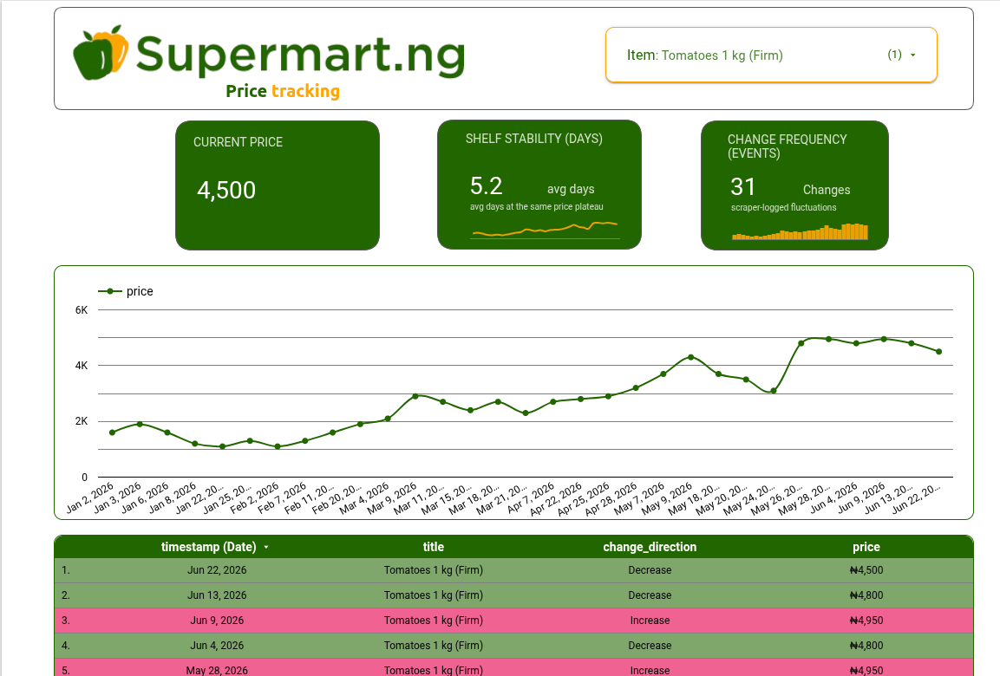

# Supermart Scraper

This project is designed to help us understand how the prices of everyday market goods change over time. It collects product data from Supermart, cleans and validates it, and turns it into analytics-ready data for reporting and trend analysis.

## What this project does

- Scrapes product data from Supermart product pages
- Normalizes and validates scraped items before storage
- Stores raw data and prepares analytics-ready datasets
- Supports loading into Google Cloud Storage and BigQuery
- Provides a dashboard for monitoring prices and product trends


## Project structure

- src/scraper: Scrapy spider, parsers, models, and pipelines
- src/storage: Google Cloud Storage helpers
- src/warehouse: BigQuery integration
- dbt: transformation models for analytics
- tests: basic pytest coverage for parsing and validation

## Running the pipeline

Install dependencies with Poetry and run the pipeline:

```bash
poetry install
poetry run scrapy crawl supermart_spider
```

## Architecture

- Scraper: Scrapy spider → Parquet
- Storage: Google Cloud Storage
- Warehouse: BigQuery
- Transform: dbt
- Orchestration: Airflow

## Data Flow


## Dashboard

This is version 1 of the [Dashboard](https://datastudio.google.com/u/0/reporting/ac8163ec-2ca0-4a90-9e37-ae887cfe6503/page/tWq1F)

, built as a test release using the old pipeline and featuring a limited set of categories. 

[Dashboard](https://datastudio.google.com/u/0/reporting/ac8163ec-2ca0-4a90-9e37-ae887cfe6503/page/tWq1F)


The version in this repository is intended to expand to include all categories in future iterations.




This project was carried out by the Data Science team at https://algrith.com/ for more information, email algrithllc@gmail.com.